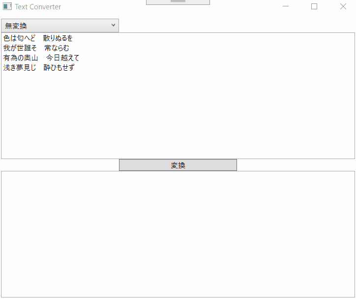

# TextConverter
 


## 機能

### 無変換

何も変換せずにそのまま出力します。

### 匿名化

テキスト内に含める人名をイニシャルに変換します。


#### 変換前
```
ホーホケキョ となりの山田くん
```
#### 変換後
```
ホーホケキョ となりのYくん
```

### ダジャレ抽出

ダジャレが含まれる行のみ抜き出します。

#### 変換前
```
アルミ缶の上にあるミカン
トンネルを抜けるとそこは雪国であった
智代子のチョコ
布団が吹っ飛んだ
我輩は猫である
猫が寝転んだ
```

#### 変換後
```
アルミ缶の上にあるミカン
智代子のチョコ
布団が吹っ飛んだ
猫が寝転んだ
```


